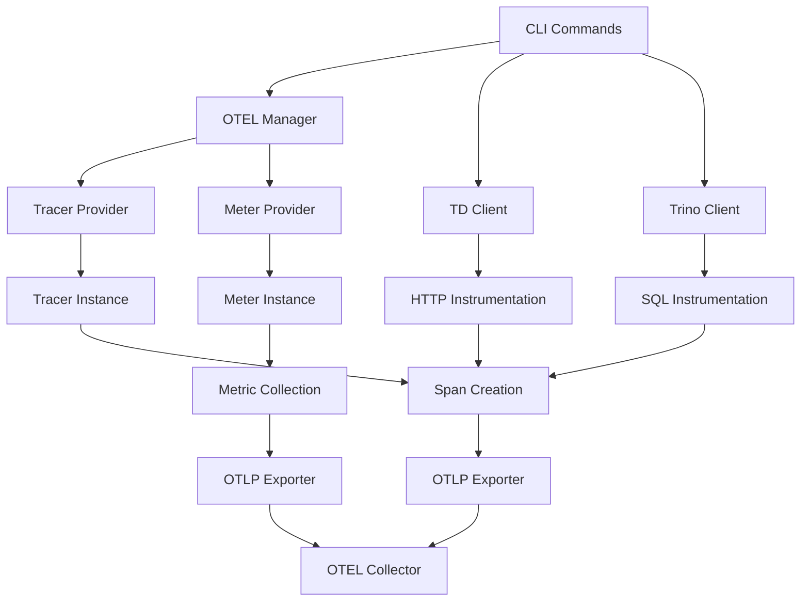

# Design Document

## Overview

This design implements comprehensive OpenTelemetry (OTEL) integration for the Treasure Data CLI (tdcli). The solution provides distributed tracing, metrics collection, and observability capabilities while maintaining backward compatibility and minimal performance overhead when disabled.

The design follows OpenTelemetry best practices and integrates seamlessly with the existing CLI architecture built on Kong CLI framework and the Treasure Data Go SDK.

## Architecture

### High-Level Architecture



### Component Integration Points

1. **CLI Layer**: Kong-based command structure with OTEL flags
2. **SDK Layer**: Treasure Data client and Trino client instrumentation
3. **Transport Layer**: HTTP client and SQL driver instrumentation
4. **Export Layer**: OTLP exporters for traces and metrics

## Components and Interfaces

### 1. OTEL Manager

Central component responsible for initializing and managing OpenTelemetry providers.

```go
type OTELManager struct {
    config       *OTELConfig
    tracer       trace.Tracer
    meter        metric.Meter
    shutdown     func(context.Context) error
    initialized  bool
}

type OTELConfig struct {
    Enabled           bool
    ServiceName       string
    ServiceVersion    string
    TraceEndpoint     string
    MetricEndpoint    string
    SamplingRate      float64
    Headers           map[string]string
    Insecure          bool
    BatchTimeout      time.Duration
    BatchSize         int
    ResourceAttrs     map[string]string
}
```

### 2. CLI Integration

Extended CLI structure with OTEL configuration flags.

```go
type CLI struct {
    // Existing fields...
    
    // OTEL Configuration
    OTELEnabled        bool              `kong:"help='Enable OpenTelemetry tracing',env='OTEL_ENABLED'"`
    OTELServiceName    string            `kong:"help='OTEL service name',env='OTEL_SERVICE_NAME',default='tdcli'"`
    OTELTraceEndpoint  string            `kong:"help='OTEL trace endpoint',env='OTEL_EXPORTER_OTLP_TRACES_ENDPOINT'"`
    OTELMetricEndpoint string            `kong:"help='OTEL metric endpoint',env='OTEL_EXPORTER_OTLP_METRICS_ENDPOINT'"`
    OTELSamplingRate   float64           `kong:"help='OTEL sampling rate (0.0-1.0)',env='OTEL_SAMPLING_RATE',default='1.0'"`
    OTELHeaders        map[string]string `kong:"help='OTEL exporter headers',env='OTEL_EXPORTER_OTLP_HEADERS'"`
    OTELInsecure       bool              `kong:"help='Use insecure OTEL connection',env='OTEL_EXPORTER_OTLP_INSECURE'"`
}
```

### 3. Instrumented Clients

#### Enhanced Trino Client

```go
type TDTrinoClient struct {
    // Existing fields...
    tracer    trace.Tracer
    meter     metric.Meter
    
    // Metrics
    queryDuration    metric.Float64Histogram
    queryCounter     metric.Int64Counter
    connectionGauge  metric.Int64UpDownCounter
}

type TDTrinoClientConfig struct {
    // Existing fields...
    EnableTracing bool
    Tracer        trace.Tracer
    Meter         metric.Meter
}
```

#### Enhanced TD Client

```go
type Client struct {
    // Existing fields...
    tracer    trace.Tracer
    meter     metric.Meter
    
    // Metrics
    requestDuration  metric.Float64Histogram
    requestCounter   metric.Int64Counter
    errorCounter     metric.Int64Counter
}
```

### 4. Instrumentation Wrappers

#### HTTP Transport Wrapper

```go
type otelHTTPTransport struct {
    base   http.RoundTripper
    tracer trace.Tracer
    meter  metric.Meter
}

func (t *otelHTTPTransport) RoundTrip(req *http.Request) (*http.Response, error) {
    ctx, span := t.tracer.Start(req.Context(), "http.request")
    defer span.End()
    
    // Add span attributes
    span.SetAttributes(
        attribute.String("http.method", req.Method),
        attribute.String("http.url", req.URL.String()),
        attribute.String("http.user_agent", req.UserAgent()),
    )
    
    // Execute request with instrumented context
    req = req.WithContext(ctx)
    resp, err := t.base.RoundTrip(req)
    
    // Record metrics and span status
    if err != nil {
        span.RecordError(err)
        span.SetStatus(codes.Error, err.Error())
    } else {
        span.SetAttributes(attribute.Int("http.status_code", resp.StatusCode))
        if resp.StatusCode >= 400 {
            span.SetStatus(codes.Error, fmt.Sprintf("HTTP %d", resp.StatusCode))
        }
    }
    
    return resp, err
}
```

## Data Models

### Span Attributes Schema

#### CLI Command Spans
- `cli.command`: Command name (e.g., "queries.submit")
- `cli.args`: Sanitized command arguments
- `cli.user`: User identifier (account ID only)
- `cli.version`: CLI version
- `cli.region`: TD region

#### Trino Query Spans
- `db.system`: "trino"
- `db.name`: Database name
- `db.statement`: SQL query (sanitized)
- `db.operation`: Query type (SELECT, INSERT, etc.)
- `trino.query_id`: Trino query ID
- `trino.catalog`: Catalog name
- `trino.schema`: Schema name

#### HTTP Request Spans
- `http.method`: HTTP method
- `http.url`: Request URL (sanitized)
- `http.status_code`: Response status code
- `http.request_content_length`: Request body size
- `http.response_content_length`: Response body size
- `td.api_version`: API version
- `td.endpoint`: API endpoint

### Metrics Schema

#### CLI Metrics
- `cli_command_duration`: Histogram of command execution time
- `cli_command_total`: Counter of commands executed
- `cli_errors_total`: Counter of command errors

#### Trino Metrics
- `trino_query_duration`: Histogram of query execution time
- `trino_query_total`: Counter of queries executed
- `trino_rows_processed`: Counter of rows processed
- `trino_bytes_processed`: Counter of bytes processed

#### HTTP Metrics
- `http_request_duration`: Histogram of HTTP request duration
- `http_requests_total`: Counter of HTTP requests
- `http_request_size`: Histogram of request sizes
- `http_response_size`: Histogram of response sizes

## Error Handling

### Graceful Degradation Strategy

1. **Missing Dependencies**: If OTEL packages are not available, use no-op implementations
2. **Configuration Errors**: Log warnings and disable telemetry
3. **Export Failures**: Retry with exponential backoff, fallback to logging
4. **Resource Constraints**: Implement circuit breaker for telemetry operations

### Error Propagation

```go
type OTELError struct {
    Operation string
    Cause     error
    Severity  ErrorSeverity
}

type ErrorSeverity int

const (
    SeverityWarning ErrorSeverity = iota
    SeverityError
    SeverityCritical
)
```

## Testing Strategy

### Unit Testing
- Mock OTEL providers for isolated testing
- Test span creation and attribute setting
- Test metric recording and export
- Test error handling and graceful degradation

### Integration Testing
- End-to-end tracing through CLI commands
- OTEL collector integration tests
- Performance impact measurement
- Configuration validation tests

### Test Utilities

```go
type TestOTELProvider struct {
    spans   []trace.Span
    metrics []metric.Measurement
}

func NewTestProvider() *TestOTELProvider
func (p *TestOTELProvider) GetSpans() []trace.Span
func (p *TestOTELProvider) GetMetrics() []metric.Measurement
func (p *TestOTELProvider) Reset()
```

### Performance Testing
- Benchmark CLI operations with/without OTEL
- Memory usage analysis
- Latency impact measurement
- Throughput degradation assessment

## Configuration Management

### Environment Variable Support
- Full compatibility with OTEL standard environment variables
- Custom TD-specific configuration options
- Hierarchical configuration precedence

### Configuration Precedence (highest to lowest)
1. CLI flags
2. Environment variables
3. Configuration file
4. Default values

### Configuration Validation
- Endpoint URL validation
- Sampling rate bounds checking
- Header format validation
- Resource attribute validation

## Security Considerations

### Data Sanitization
- Remove sensitive data from span attributes
- Sanitize SQL queries (remove literals)
- Mask API keys in URLs and headers
- Limit span attribute sizes

### Transport Security
- Support TLS for OTLP exports
- Certificate validation options
- Header-based authentication
- Secure credential storage

## Performance Optimization

### Sampling Strategies
- Configurable sampling rates
- Adaptive sampling based on load
- Priority-based sampling for critical operations

### Batching and Buffering
- Configurable batch sizes
- Timeout-based flushing
- Memory-bounded buffers
- Async export processing

### Resource Management
- Connection pooling for exporters
- Graceful shutdown procedures
- Resource cleanup on errors
- Memory leak prevention
